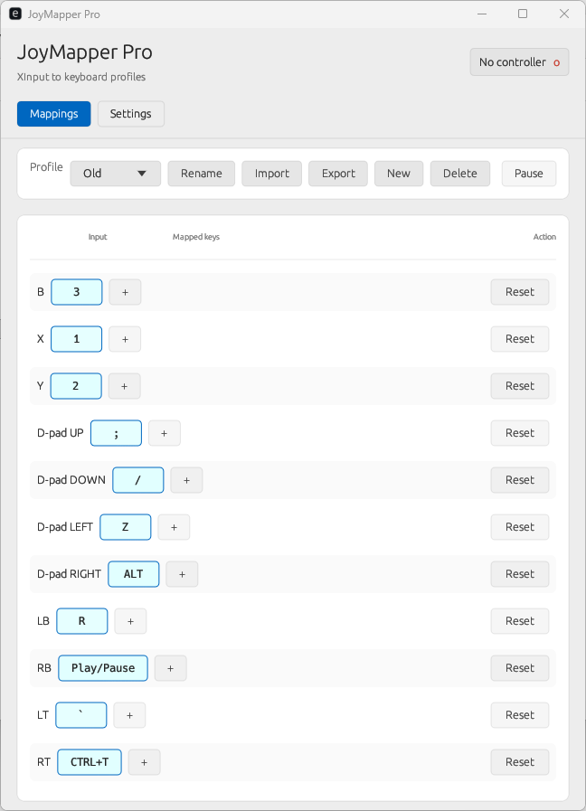

# 🎮 JoyMapper Pro

**Lightweight Windows-native controller-to-keyboard macro mapper.**  
Map every button, trigger, and thumbstick direction on your XInput gamepad to keyboard keys, shortcuts, or combos. Built in Rust with pure Win32 APIs — no bloat, no Electron, no WebViews.


---

## ✨ Features

| Feature | Detail |
|---|---|
| 🎮 **Full XInput** | All 24 inputs: A/B/X/Y, D-pad, bumpers, triggers (analog→digital), thumbstick clicks + 4 directions each, Start/Back/Guide |
| ⌨️ **Multi-Key Macros** | Map up to **10 simultaneous keys** per input — e.g. `ctrl+shift+esc` all at once |
| 🔢 **Numpad Support** | Distinct VK_NUMPAD0–9, VK_ADD/SUBTRACT/MULTIPLY/DIVIDE/DECIMAL — games and DAWs see real numpad keystrokes |
| 📝 **Live Recording** | Click any key cell, press the keyboard combo you want — instant assign. Records to the **exact slot** clicked. Escape cancels. |
| 🖱️ **Categorized Context Menus** | Right-click any cell for: Letters A–M, Letters N–Z, Numbers 0–9, Symbols & Brackets, Modifiers & Controls, Function Keys |
| 📂 **Per-Profile Files** | Each profile = one `.json` file in the exe directory. Copy, share, or edit them directly. No AppData, no registry bloat. |
| 🔄 **Profile Management** | Switch, New, Rename, Delete, Import, Export — all self-contained in the exe folder |
| ⭐ **Last-Used Priority** | Profiles carry a `last_used` flag; the app restores the last-active profile on startup |
| 🖼️ **System Tray** | Minimizes to tray on close. Three custom tray icons (disconnected, ready, pressing). Left-click restores window. Right-click → Show Mapper / Exit. |
| 🔊 **Sound Feedback** | Plays a click on button press via a dedicated audio thread — works even while window is hidden (trayed) |
| 🎨 **Win11 Mica Backdrop** | Translucent acrylic-style background using `window-vibrancy` + DwmSetWindowAttribute |
| 🌓 **Theme Support** | System (auto-dark/light via registry), Dark, Light |
| 🚀 **Startup Launch** | Optional silent launch on Windows startup via `HKCU\...\Run` |
| 🗑️ **Clear Mapping** | 🗑 button in the Action column to reset any input to a single unmapped slot |
| 👁️ **Row Highlight** | Full-width blue tint highlights the entire row when a controller button is pressed |
| ⚡ **250 Hz Polling** | High-precision Windows timer (`timeBeginPeriod(1)`) for near-instant input response |

---

## 🖼️ Screenshot



*(Replace `Screenshot.png` with an actual screenshot of the app)*

---

## 🚀 Quick Start

### 🏗️ Build from Source

```powershell
# Prerequisites: Rust toolchain (rustup, cargo)
# Windows SDK (installed with Visual Studio Build Tools)

git clone https://github.com/mwolfinspace/joymapper_rust.git
cd joymapper_rust

# Debug build
cargo run

# Release build (fully optimized, no console window)
cargo build --release
```

### 📦 Download

Pre-built binaries are available on the [Releases](https://github.com/mwolfinspace/joymapper_rust/releases) page.  
Just unzip and run `joymapper_rust.exe` — no installer needed.

---

## 🎯 Usage

1. **Launch the app** — it sits in your system tray immediately
2. **Plug in an XInput controller** — the status indicator in the status bar turns green
3. **Map your buttons**:
   - **Click a key cell** → the cell turns amber with a gold border → press the desired keyboard keys → instantly assigned to that slot ✨
   - **Right-click** any cell for the **categorized context menu** (Letters, Numbers, Symbols, Modifiers, F-Keys)
   - Click **➕** to add more simultaneous key slots (up to 10 per input)
   - Click **🗑** to reset the input to a single empty slot
4. **Switch profiles** via the dropdown in the toolbar
5. **Import/Export, New, Rename, Delete** profiles from the toolbar
6. **Settings tab**: toggle tray-on-close, startup launch, sound, and theme

### 🎮 All Supported Inputs

```
A  B  X  Y
DPAD_UP  DPAD_DOWN  DPAD_LEFT  DPAD_RIGHT
LB  RB  LT  RT
LS_CLICK  RS_CLICK  START  BACK  GUIDE
LS_UP  LS_DOWN  LS_LEFT  LS_RIGHT
RS_UP  RS_DOWN  RS_LEFT  RS_RIGHT
```

### ⌨️ Supported Mapped Keys

- **Single keys**: `a`–`z`, `0`–`9`, `space`, `enter`, `escape`, `tab`, `backspace`, `caps`, `delete`, `insert`
- **Modifiers**: `ctrl`, `shift`, `alt`, `win`, `lctrl`, `rctrl`, `lshift`, `rshift`, `lalt`, `ralt`
- **Combos**: `ctrl+c`, `shift+alt+a`, `win+r`, etc. (in a single slot they fire simultaneously)
- **Navigation**: `arrowup`, `arrowdown`, `arrowleft`, `arrowright`, `home`, `end`, `pgup`, `pgdown`
- **Numpad**: `num0`–`num9`, `num+`, `num-`, `num*`, `num/`, `num.`, `num_enter`
- **OEM symbols**: `;`, `/`, `` ` ``, `[`, `\`, `]`, `'`, `,`, `.`, `-`, `=`
- **F-keys**: `f1`–`f12`
- **Media keys**: `vol_mute`, `vol_up`, `vol_down`, `media_play_pause`, `media_next`, `media_prev`, `media_stop`
- **Launch keys**: `launch_mail`, `launch_media`, `launch_pc`, `launch_calc`
- **Browser keys**: `browser_back`, `browser_forward`, `browser_refresh`, `browser_search`, `browser_fav`, `browser_home`

---

## 📂 Profile System

Profiles are stored as individual `.json` files **in the same folder as the executable**.

```
📁 JoyMapper Pro/
├── joymapper_rust.exe
├── Default.json          ← Auto-created on first launch
├── My Config.json        ← Your profiles
├── Racing Setup.json
└── ...
```

### 📤 Backup & Sharing

Because profiles are just `.json` files in the exe directory:

- **Backup**: Copy any `.json` file to a safe location
- **Share**: Send the `.json` file to another JoyMapper Pro user
- **Hand-edit**: Open any `.json` in Notepad — keys are plain text strings
- **Restore**: Put a `.json` file into the exe folder and restart the app, or use *Import* from the toolbar

### Profile JSON Format

Each input can hold **up to 10 simultaneous key strings** in an array:

```json
{
  "last_used": true,
  "mappings": {
    "A": ["ctrl", "c"],
    "B": ["v"],
    "X": ["space"],
    "Y": ["enter"],
    "DPAD_UP": ["arrowup"],
    "LB": ["shift"],
    "RB": ["ctrl"],
    ...
  }
}
```

- The `last_used` flag tracks the most recently active profile across sessions
- Arrays with a single string are cleanly backward-compatible with old single-string profiles (auto-migrated on load)
- Missing inputs are automatically repaired on startup (forward-compatible with new controller buttons)

---

## ⚙️ Technical Architecture

```
┌─────────────────────────────────────────────────────────┐
│                    eframe / egui UI                      │
│  ┌─────────────┐  ┌──────────────┐  ┌───────────────┐  │
│  │ Mappings Tab │  │ Settings Tab │  │ Rename Dialog │  │
│  │  · ScrollArea│  │  · Tray      │  └───────────────┘  │
│  │    + grid    │  │  · Startup   │                     │
│  │  · Recorder  │  │  · Sound     │                     │
│  │  · Context   │  │  · Theme     │                     │
│  │    menu      │  └──────────────┘                     │
│  └──────┬───────┘                                       │
│         │                                               │
│         └────────┬───────────────────────────────────────┘
│                  ▼                                       │
│           AppState (in-memory)                           │
│  ┌──────────────────────────────────────────────────────┐│
│  │  profiles: HashMap<String, Profile>                  ││
│  │  active_mapping: Arc<Mutex<HashMap<String, Vec<...>>││
│  └──────────────────────┬───────────────────────────────┘│
└─────────────────────────┼────────────────────────────────┘
                          │
              ┌───────────┴───────────┐
              ▼                       ▼
    ┌─────────────────┐    ┌──────────────────────┐
    │  save_to_disk()  │    │  Polling Thread      │
    │  Writes .json    │    │  (250 Hz)            │
    │  per profile     │    │                      │
    └─────────────────┘    │  XInputGetState()     │
                           │  → for each Vec<>     │
                           │  → SendInput()        │
                           │  → SoundEngine.send() │
                           │  → update_tray_icon() │
                           └──────────────────────┘
```

### 🧵 Thread Model

| Thread | Role |
|---|---|
| **Main (egui)** | UI rendering, recording handler, profile management |
| **Polling** | XInputGetState loop at ~250 Hz (`timeBeginPeriod(1)`), fires `SendInput` + sound + tray updates. For multi-key arrays: forward iteration on key-down, reverse on key-up. |
| **Sound** | Decodes and plays `.wav` via rodio; receives triggers via `mpsc` channel (works even while window is hidden) |

### 🪟 No Console Window

The app uses `#![windows_subsystem = "windows"]` to suppress the console in both debug and release builds. All diagnostics are silent by design.

### 🔄 Old Profile Migration

When loading a `.json` file that uses the old single-string format (`"A": "ctrl+c"`), the app automatically detects it via `OldProfile` struct and converts it to the new `Vec<String>` format on load. No manual migration needed.

---

## 🛠️ Build Dependencies

| Crate | Version | Purpose |
|---|---|---|
| `eframe` | 0.27 | Window, event loop, egui integration |
| `egui_extras` | 0.27 | (Cargo.toml only, no longer used in UI — pending cleanup) |
| `windows-sys` | 0.59 | Direct Win32 FFI (XInput, SendInput, tray, registry, multimedia timer) |
| `rodio` | 0.17 | Audio playback |
| `serde` / `serde_json` | 1.0 | Profile serialization |
| `winreg` | 0.52 | Windows Registry access (theme, startup) |
| `window-vibrancy` | 0.5 | Win11 Mica backdrop |
| `rfd` | 0.14 | Native file dialogs |
| `raw-window-handle` | 0.6 | HWND extraction for Mica |
| `winres` | 0.1 | `.exe` icon + manifest embedding (build-only) |

---

## 📄 License

Copyright © M-Wolf Studio. All rights reserved.

---

## 🙏 Acknowledgments

- [egui](https://github.com/emilk/egui) — immediate-mode GUI library
- [rodio](https://github.com/RustAudio/rodio) — audio playback
- [XInput](https://learn.microsoft.com/en-us/windows/win32/xinput/xinput-input) — controller API
